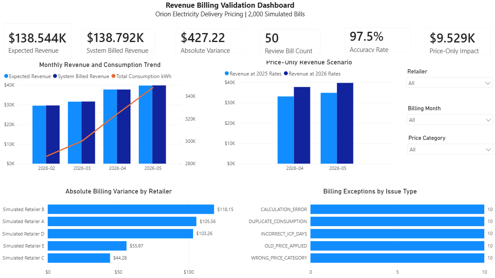
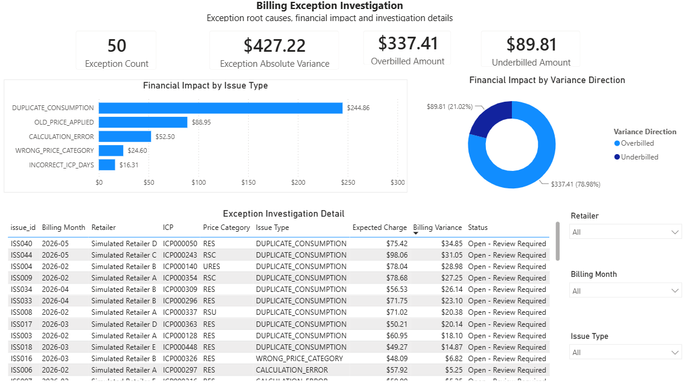

# Electricity Billing & Revenue Validation

An end-to-end portfolio project using public Orion delivery price schedules and simulated operational data to independently calculate expected billing, reconcile system-generated charges, investigate exceptions, assess annual pricing changes, and report revenue outcomes.

> **Data note:** Orion's public 2025 and 2026 delivery price schedules are used as source rules. All retailers, ICPs, consumption, system billing, exceptions, and financial results are simulated and do not represent Orion's actual operations or revenue.

## Power BI dashboards

### Revenue Billing Validation Dashboard



The overview monitors expected and system-billed revenue, billing accuracy, review workload, absolute variance, monthly revenue and consumption trends, retailer-level variance, and the isolated impact of annual price changes.

### Billing Exception Investigation



The investigation page identifies exception root causes and financial impact, separates overbilling from underbilling, and supports drill-down to individual simulated bills by retailer, month, ICP, price category, and issue type.

The interactive Power BI report is available here:

- [`Orion_Revenue_Billing_Validation.pbix`](powerbi/Orion_Revenue_Billing_Validation.pbix)
- [`Orion_Revenue_Billing_Validation.pdf`](powerbi/Orion_Revenue_Billing_Validation.pdf)

## Business objective

The project simulates a revenue-control workflow designed to answer the following operational questions:

1. Were delivery charges calculated using the correct price category, component rate, quantity, and effective date?
2. Does system billing reconcile to an independently calculated expected amount?
3. Which bills require review, what caused each discrepancy, and what is the financial impact?
4. Which retailers and issue types should be prioritised for investigation?
5. What is the price-only impact of applying the 2026 schedule instead of the 2025 schedule to identical quantities?

## Business systems analysis

The repository includes a business-systems analysis layer connecting the implemented workflow to New Zealand electricity-market context, functional requirements, solution choices and test evidence:

- [New Zealand Electricity Market Context](docs/nz_electricity_market_context.md) — participant and ICP context, relevant Code concepts, system boundaries and the distinction between billing validation and Part 15 market reconciliation.
- [Business Systems Analysis Pack](docs/business_systems_analysis_pack.md) — stakeholders, current/future process, functional and non-functional requirements, business rules, solution shaping, configuration impact and UAT criteria.
- [Requirements Traceability Matrix](docs/requirements_traceability_matrix.csv) — requirement-to-implementation, test and operational-output traceability.

These documents describe a portfolio case study. They do not represent customer discovery, an Orion implementation engagement, Registry integration or regulatory compliance.

## Key results

| Revenue and billing result | Outcome |
|---|---:|
| Simulated ICPs | 500 |
| Monthly bills reconciled | 2,000 |
| Component-level expected calculations | 12,000 |
| Total expected delivery charges | $138,544.09 |
| Bills passing validation | 1,950 |
| Billing accuracy rate | 97.5% |
| Controlled exception bills | 50 |
| Exceptions detected and classified | 50 of 50 |
| False positives / false negatives | 0 / 0 |
| Total absolute billing variance | $427.22 |
| Simulated 2026 price-only impact | $9,528.74 |

## Exception investigation

Fifty controlled exceptions were introduced across five root-cause types to test whether the reconciliation workflow could identify and classify billing discrepancies.

| Issue type | Bills | Net variance | Absolute impact |
|---|---:|---:|---:|
| Duplicate consumption | 10 | $244.86 | $244.86 |
| Old price applied | 10 | -$88.95 | $88.95 |
| Calculation error | 10 | $52.50 | $52.50 |
| Wrong price category | 10 | $22.88 | $24.60 |
| Incorrect ICP days | 10 | $16.31 | $16.31 |
| **Total** | **50** | **$247.60** | **$427.22** |

Absolute variance is used as the primary risk and workload measure because positive and negative billing differences can offset in the net result. Duplicate consumption produced the largest financial exposure, followed by use of the old annual price schedule.

## Annual pricing change analysis

The 2025 and 2026 price schedules were standardised and validated across four residential price categories and six components per category and year. Effective-date boundary tests confirm that:

- the 2025 schedule applies through 31 March 2026;
- the 2026 schedule applies from 1 April 2026;
- all 24 component changes reconcile to their published delivery-price totals.

Using identical April and May quantities, price categories, and connection days, the 2026 rates increased simulated expected delivery charges by `$9,528.74`:

- April: `$4,648.92`
- May: `$4,879.82`

This isolates the effect of the rate change and does not represent Orion's actual revenue movement.

## Revenue-control workflow

```text
Public 2025 and 2026 delivery price schedules
                       |
                       v
        Standardise and validate price rules
                       |
                       v
       Generate reproducible simulated billing data
                       |
                       v
     Independently calculate expected component charges
                       |
                       v
        Reconcile expected and system billing results
                       |
                       v
      Detect, classify and quantify billing exceptions
                       |
             +---------+---------+
             v                   v
      SQL validation       Power BI reporting
```

The complete workflow can be run through one entry point:

```bash
python3 run_all.py
```

It executes nine ordered stages and stops if a validation fails.

## Controls implemented

- **Price schedule validation:** component uniqueness, units, effective dates, and delivery-price arithmetic.
- **Input data validation:** required fields, duplicates, relationships, billing periods, and consumption quantities.
- **Independent recalculation:** fixed daily and time-of-use charges calculated from controlled rules.
- **Expected-versus-system reconciliation:** bill-level comparison with material exceptions routed for review.
- **Root-cause classification:** old price, wrong category, incorrect ICP days, duplicate consumption, and calculation errors.
- **Annual price testing:** effective-date boundary tests and like-for-like price-impact analysis.
- **SQL cross-validation:** executable SQLite logic reproduces the Python expected billing and identifies the same 50 review bills.
- **Operational reporting:** revenue, consumption, retailer, price-category, exception, and financial-impact views.

## Skills demonstrated

- Billing reconciliation and revenue assurance
- Pricing implementation support and billing validation
- Requirements analysis and business-rule modelling
- Requirements-to-function, configuration, development and process mapping
- System and process modelling, UAT criteria, and requirements traceability
- New Zealand electricity-market and ICP context
- Data-quality investigation and exception management
- Revenue, billing, consumption, and trend analysis
- Process controls and continuous-improvement recommendations
- Python, Pandas, SQL, SQLite, Power BI, DAX, and data modelling
- Clear reporting for retailer-level and business-level review

## Technology

| Area | Tools and approach |
|---|---|
| Data preparation and validation | Python, Pandas, NumPy |
| Billing and reconciliation logic | Python and executable SQLite views |
| Reporting and investigation | Power BI, DAX, interactive slicers and drill-down |
| Source rules | Public Orion PDF delivery price schedules |
| Operational data | Reproducible simulated retailer, ICP, consumption, and billing records |

## Repository structure

```text
electricity-billing-validation/
├── README.md
├── requirements.txt
├── run_all.py
├── scripts/            # Nine ordered Python workflow stages
├── sql/                # Data-quality, billing, reconciliation and reporting SQL
├── tests/              # Validation evidence produced by the workflow
├── docs/
│   ├── nz_electricity_market_context.md
│   ├── business_systems_analysis_pack.md
│   ├── requirements_traceability_matrix.csv
│   └── ...             # Scope, rules, assumptions, sources and findings
├── powerbi/
│   ├── Orion_Revenue_Billing_Validation.pbix
│   ├── Orion_Revenue_Billing_Validation.pdf
│   └── screenshots/
└── data/
    ├── raw/            # Public Orion source documents
    ├── reference/      # Standardised price schedules and change analysis
    ├── simulated/      # Reproducible simulated operational inputs
    └── output/         # Reconciliation, exception and reporting outputs
```


## Scope and limitations

The project covers four residential delivery price categories—URES, RES, RSU, and RSC—and fixed daily, weekend, peak, shoulder, off-peak, and zero-rated super-off-peak components for February to May 2026.

It excludes retail energy charges, retailer margins, GST, payments, debt collection, loss factors, export credits, Winter Peak Injection, and non-residential pricing. It does not reproduce Orion's internal billing system, approval process, confidential data, or actual revenue performance.

The project also does not connect to the Electricity Registry, use production metering or retailer data, prepare market-reconciliation submissions, calculate wholesale settlement obligations, or claim compliance with the Electricity Industry Participation Code. In this repository, **reconciliation** means expected-versus-system delivery-charge validation, not Part 15 market reconciliation.
