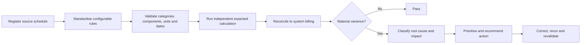

# Business Systems Analysis Pack

## Purpose

This pack presents the project as a business-systems case study. It connects the operational problem to stakeholders, requirements, business rules, solution choices, controls and acceptance evidence.

The stakeholder roles and current-state scenario below are portfolio personas, not records of interviews with Orion or another electricity company.

## Business problem

Annual delivery-price changes create a controlled implementation problem:

- published price categories, components, units and effective dates must be standardised correctly;
- ICP master data must select the correct price category;
- fixed and time-band quantities must use the correct unit and rate;
- the system-billed result needs an independent control;
- material differences must be classified, prioritised and routed for review;
- users need traceable evidence from source rule through calculation, exception and reporting.

Without a repeatable control workflow, manual checking can miss an old price, wrong category, incorrect connection-day quantity, duplicated component or calculation error.

## Objectives and success measures

| Objective | Success measure | Evidence |
|---|---|---|
| Translate public price schedules into controlled system rules | Four categories and six components per category/year validate with correct units and effective dates | `scripts/01_validate_price_schedules.py` |
| Select the correct annual configuration | Boundary tests pass for the last 2025-schedule date and first 2026-schedule date | `tests/price_effective_date_tests.csv` |
| Preserve linked-data integrity | ICP, retailer, consumption and category relationship checks pass | `tests/input_data_validation_results.csv` |
| Calculate an independent expectation | Each bill has six valid components and reconciles to its component detail | `tests/expected_billing_validation_results.csv` |
| Detect and explain material exceptions | All controlled exceptions are detected and correctly classified without false positives or false negatives | `tests/billing_reconciliation_validation_results.csv` |
| Cross-check implementation logic | Executable SQLite results match Python expected billing | `tests/sql_workflow_validation_results.csv` |
| Support operational decisions | Exceptions include priority, financial impact, root cause and recommended action | `data/output/billing_exception_log.csv` |

## Stakeholder needs

| Portfolio stakeholder | Need | Project response |
|---|---|---|
| Pricing analyst | Confirm published price changes have been standardised completely and accurately | Source validation, component comparison and effective-date tests |
| Billing operations analyst | Identify which bills require review and why | Expected-versus-system reconciliation and root-cause classification |
| Revenue or finance analyst | Understand net and absolute financial impact | Revenue, variance and price-impact outputs |
| System support analyst | Reproduce an issue and identify the affected rule, data or calculation | Component-level detail, issue type, evidence path and recommended action |
| Business manager | Prioritise review workload and understand operational risk | Retailer, category, month, priority and financial-impact reporting |

## Process analysis

### Hypothetical current state

Risks in this scenario include inconsistent interpretation, incomplete regression coverage, limited traceability and reactive exception investigation.

### Designed future state

## Functional requirements

| ID | Functional requirement | Acceptance summary |
|---|---|---|
| FR-01 | Validate that each annual price configuration contains the expected categories, components, units and effective dates | Validation stops the workflow if a required rule is missing, duplicated or inconsistent |
| FR-02 | Validate unique keys and relationships across retailer, ICP and consumption data | No duplicate keys, orphan references or invalid price categories |
| FR-03 | Select the applicable price configuration for the complete billing period | 2025 configuration applies through 31 March 2026 and 2026 configuration from 1 April 2026 |
| FR-04 | Match each ICP quantity to the correct category and component rate | Every expected component has one valid price match and compatible unit |
| FR-05 | Independently calculate component and monthly expected delivery charges | Six components per bill and monthly totals reconcile to detail |
| FR-06 | Compare each expected result with the simulated system-billed result | Every expected and system bill is present and assigned PASS or REVIEW |
| FR-07 | Detect and classify supported root-cause types | Old price, wrong category, incorrect ICP days, duplicate consumption and calculation error are distinguished |
| FR-08 | Produce an actionable exception record | Each REVIEW item has issue ID, impact, direction, priority, recommended action and status |
| FR-09 | Provide operational reporting by month, retailer, category and issue | Reporting outputs reconcile to the billing population and exception count |
| FR-10 | Cross-validate core billing logic independently in SQL | SQLite and Python bill keys and expected amounts match |
| FR-11 | Stop downstream processing when an upstream validation fails | `run_all.py` exits when any ordered stage returns an error |

Detailed requirement-to-implementation evidence is maintained in the [Requirements Traceability Matrix](requirements_traceability_matrix.csv).

## Business rules

| ID | Rule | Implementation implication |
|---|---|---|
| BR-01 | Billing periods ending on or before 31 March 2026 use the 2025 schedule | Effective-dated price selection and boundary test |
| BR-02 | Billing periods starting on or after 1 April 2026 use the 2026 schedule | New annual configuration becomes effective on 1 April |
| BR-03 | An ICP's controlled master-data category determines the applicable price category | Category is joined from `icp_master.csv` |
| BR-04 | Fixed Daily Charge uses inclusive ICP days | Quantity unit is connection days |
| BR-05 | Weekend, Peak, Shoulder, Off Peak and Super Off Peak use kWh | Quantity unit must match `$/kWh` |
| BR-06 | Super Off Peak consumption is retained even when the published rate is zero | Zero charge does not remove the consumption record |
| BR-07 | Component arithmetic remains unrounded until monthly aggregation | Prevents avoidable rounding differences |
| BR-08 | Monthly expected delivery charge is rounded after component aggregation | Display amount is two decimal places |
| BR-09 | A difference within one cent is not a material billing variance | Result is PASS when absolute unrounded difference is at most $0.01 |
| BR-10 | Duplicate bill/component lines indicate duplicate consumption processing | Duplicate component detection creates a root-cause classification |
| BR-11 | Applied category and year must match the expected master-data and effective-date selection | Differences are routed to REVIEW |
| BR-12 | Stored system line amounts must reconcile to independently recalculated quantity multiplied by price | A mismatch is classified as calculation error |

## Non-functional requirements

| ID | Requirement | Design response |
|---|---|---|
| NFR-01 | Reproducibility | Fixed random seeds and one ordered execution entry point |
| NFR-02 | Traceability | Source register, documented rules, stable IDs, component detail, test IDs and exception IDs |
| NFR-03 | Auditability | CSV evidence retained for validation, reconciliation and reporting checks |
| NFR-04 | Accuracy | Unrounded arithmetic, controlled tolerances and independent SQL cross-validation |
| NFR-05 | Maintainability | Annual prices are held as standardised reference data rather than embedded throughout reporting |
| NFR-06 | Fail-fast control | Any failed validation stops later workflow stages |
| NFR-07 | Transparency | Public source rules and simulated operational data are explicitly distinguished |

## Solution shaping: function, configuration, development or process

| Business need | Recommended solution type | Rationale |
|---|---|---|
| Load a new annual delivery-price schedule | Configuration and controlled reference-data update | The categories, components, units, prices and effective dates are data-driven rules |
| Support a new price category or component structure | Configuration plus impact assessment; development if the quantity logic changes | A like-for-like rate change is configuration, while a new charging basis can require code and reporting changes |
| Apply the correct annual price | Existing effective-date function and regression tests | The implemented logic already selects rules by billing period within project scope |
| Identify a wrong applied category or old price | Existing validation function | Root-cause checks compare applied and expected values |
| Add a new exception type | Development and test update | Detection logic, action mapping, controlled test data and reporting classification must change together |
| Route material exceptions for investigation | Existing reporting and operational process | The exception log provides priority, action and status; a production owner/workflow is outside scope |
| Correct an affected bill | Operational process and source-system action | The portfolio project recommends the action but does not update a production billing system |

This distinction demonstrates how a requirement can be mapped to an existing function, a configuration change, new development or a business-process change.

## Annual pricing configuration impact assessment

| Change area | 2025-to-2026 impact | Required check |
|---|---|---|
| Effective dates | Old configuration closes on 31 March 2026; new configuration starts on 1 April 2026 | Boundary-date regression |
| Category/component completeness | Four selected categories retain six components each | One-to-one comparison and missing/new/discontinued check |
| Delivery prices | Component rates change by category | Source-to-reference comparison and arithmetic validation |
| Units | Fixed and variable charging bases must remain compatible | Unit validation |
| Expected calculation | Same quantities can produce different charges under new rates | Like-for-like price-impact test |
| Reporting | Price year and price-only impact must remain visible | Reporting output validation |

### Release-oriented decision

A rate-only update can be handled as reference-data configuration when category structure, component structure, units and calculation bases remain compatible. A new component, unit, charging basis or cross-boundary billing requirement should trigger functional impact analysis and may require development.

## UAT and acceptance criteria

| Scenario | Expected result | Evidence |
|---|---|---|
| 31 March 2026 billing date | 2025 price year selected | `tests/price_effective_date_tests.csv` |
| 1 April 2026 billing date | 2026 price year selected | `tests/price_effective_date_tests.csv` |
| Valid category and six valid components | Expected bill calculated and passes component checks | B03–B06 |
| Wrong applied price year | Bill is REVIEW and classified `OLD_PRICE_APPLIED` | R03–R08 |
| Wrong applied price category | Bill is REVIEW and classified `WRONG_PRICE_CATEGORY` | R03–R08 |
| Fixed quantity differs from inclusive ICP days | Bill is REVIEW and classified `INCORRECT_ICP_DAYS` | R03–R08 |
| Duplicate bill/component line | Bill is REVIEW and classified `DUPLICATE_CONSUMPTION` | R03–R08 |
| Stored charge differs from quantity multiplied by price | Bill is REVIEW and classified `CALCULATION_ERROR` | R03–R08 |
| Clean bill | Bill is PASS and no false-positive issue is produced | R04 and R07 |
| Python and SQL expected calculations | Keys and unrounded amounts match | SQL02 and SQL03 |
| Any upstream validation fails | Later stages do not run | `run_all.py` fail-fast execution |

## Operational exception workflow

1. Review the issue ID, financial impact and priority.
2. Confirm the detected root cause against component-level evidence.
3. Identify whether the correction belongs to reference configuration, ICP master data, quantity input, duplication handling or calculation logic.
4. Correct the relevant source or system process outside this simulation.
5. Rerun the affected calculation and reconciliation.
6. Confirm the bill passes and retain the test evidence.

## Scope and limitations

- The analysis pack documents a portfolio system, not an Orion implementation engagement.
- Stakeholders are representative personas; no customer requirements were collected.
- UAT evidence is automated project evidence, not sign-off from business users.
- The solution does not update a live billing platform or manage production access, deployment or audit approval.
- Billing periods do not cross the annual effective-date boundary; such periods would require split and prorated logic.
- The regulatory context is documented separately and is not a claim of Code compliance.
