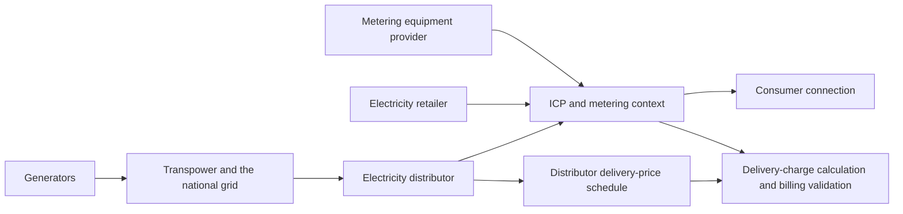
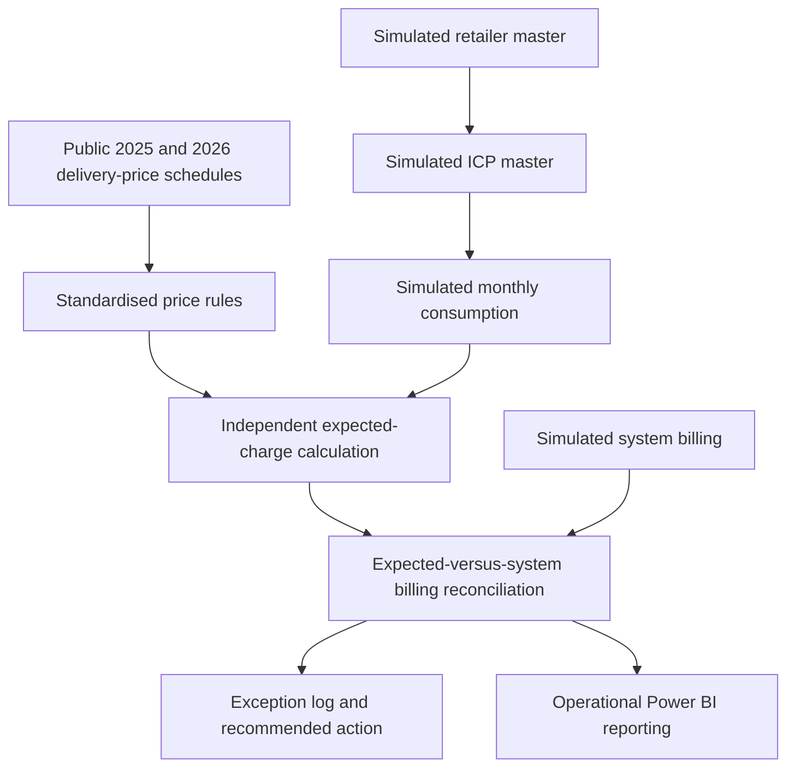

# New Zealand Electricity Market Context

## Purpose

This note places the portfolio project in its relevant New Zealand electricity-market context. It explains the participant and information relationships that make ICP, pricing, consumption and billing data important to an electricity business system.

It is not a legal opinion or a claim that the project reproduces the Electricity Registry, a participant's production system, or market reconciliation under the Electricity Industry Participation Code 2010.

## Industry and information context

New Zealand's electricity supply chain includes generators, Transpower as the national grid owner and operator, local distribution companies, electricity retailers, metering participants and consumers. The project focuses on a narrow downstream use case: validating whether publicly available distributor delivery prices have been applied correctly to simulated ICP-level billing records.

The Electricity Authority describes the Electricity Registry as the national database of electricity connections. It enables retailers, metering equipment providers and distributors to share information for consumer switching, reconciliation and invoicing. The registry stores technical information about each installation control point (ICP), including the responsible retailer and network and metering information.

## Project system boundary

The project uses the following linked datasets:

The model therefore demonstrates data relationships and controls across:

- distributor price category and component reference data;
- simulated retailer and ICP master data;
- simulated time-band consumption and connection-day quantities;
- independently calculated expected delivery charges;
- simulated system-billing outputs;
- exception, financial-impact and reporting outputs.

No project record is sourced from the Electricity Registry, a retailer, a metering equipment provider or Orion's internal systems.

## Regulatory and business relevance

| Market or Code concept | Business-system relevance | Project analogue | Coverage boundary |
|---|---|---|---|
| ICP information management | An ICP is a key link between connection, retailer, network and metering information | Unique simulated ICP identifiers, retailer relationships and ICP price-category master data | Conceptual and simulated; no Registry connection |
| Complete and accurate information | Incorrect or incomplete reference and volume data can affect downstream processing and reporting | Required-field, uniqueness, relationship, category, date and quantity checks | Implemented for the simulated project data only |
| Effective-dated information | A rule or reference-data change must apply to the correct business period | 2025/2026 price schedules and 31 March/1 April boundary tests | Implemented for complete monthly billing periods |
| Correction of errors | Identified errors require a controlled correction and revalidation path | Root-cause classification, recommended action and rerun-ready workflow | Implemented as a portfolio control design |
| Traceability | A result should be traceable from source rule and master data through calculation, exception and report | Source register, standardised rules, calculated detail, test evidence and exception log | Implemented within repository boundaries |
| Reconciliation | Differences between controlled expectations and recorded outcomes require investigation | Expected-versus-system delivery-charge comparison | Billing validation only; not Code Part 15 market reconciliation |

### Part 11: Registry information management

Part 11 of the Electricity Industry Participation Code covers Registry information management, including ICP identifiers, ICP status, participant provision and changes of ICP information, Registry reporting and error correction. These obligations provide useful context for why accurate keys, relationships, statuses and effective information matter in interconnected electricity systems.

The project reflects that control mindset through:

- unique ICP and consumption identifiers;
- valid ICP-to-retailer relationships;
- controlled ICP price-category mappings;
- complete billing-month coverage;
- explicit simulated-data labels;
- source-to-output evidence paths.

It does not implement Registry functional specifications, participant notifications, switching or production Registry transactions.

### Part 15: Market reconciliation

Part 15 addresses market reconciliation: how participants gather, store, prepare, submit, correct and reconcile electricity volume information and how responsibilities are allocated among market participants. It includes requirements for complete and accurate information and for allocating ICP volume information using relevant Registry data.

This repository uses the word **reconciliation** in a different and narrower sense. It compares an independently calculated expected distributor delivery charge with a simulated system-billed charge. It does not:

- prepare or submit market reconciliation information;
- allocate traded electricity volumes to network supply points;
- reproduce reconciliation-manager calculations;
- calculate wholesale settlement obligations;
- claim compliance with Part 15.

Keeping this distinction explicit prevents a billing-control portfolio project from overstating its regulatory scope.

## Requirement implications for an energy business system

The market context translates into practical system-analysis questions:

1. Which participant or source owns each item of reference and operational data?
2. Which identifier links the records across systems?
3. Which business date determines the applicable rule or configuration?
4. What validation prevents incomplete, duplicate or inconsistent information from moving downstream?
5. Can a result be traced from source rule to calculation, system output, exception and report?
6. Should a new need be handled through reference-data configuration, an existing workflow, new validation logic or an operational process change?
7. What regression and acceptance tests are required before an annual pricing change is released?

These questions drive the requirements, solution mapping and acceptance criteria in the [Business Systems Analysis Pack](business_systems_analysis_pack.md).

## Sources

- [Electricity Authority — New Zealand's electricity sector](https://www.ea.govt.nz/your-power/new-zealands-electricity-sector/)
- [Electricity Authority — Electricity Registry](https://www.ea.govt.nz/industry/retail/electricity-registry/)
- [Electricity Authority — Electricity Industry Participation Code 2010, Part 11: Registry information management](https://www.ea.govt.nz/code-and-compliance/the-code-electricity-industry-participation-code-2010/part-11-registry-information-management/1118a-registry-manager-to-advise-metering-equipment-providers/)
- [Electricity Authority — Electricity Industry Participation Code 2010, Part 15: Reconciliation](https://www.ea.govt.nz/code-and-compliance/the-code-electricity-industry-participation-code-2010/part-15-reconciliation/1512-accuracy-of-submitted-information/)

Official market and Code sources were accessed on 28 July 2026. Orion source documents used for the implemented pricing rules are recorded separately in the [Source Register](source_register.md).
